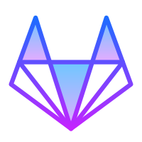

  

  

<!-- Social icons section -->

  
  &#8287;&#8287;&#8287;&#8287;&#8287;
  <a href="https://niv-devops.github.io">
   &#8287;&#8287;&#8287;&#8287;&#8287;
  
  &#8287;&#8287;&#8287;&#8287;&#8287;
  
  &#8287;&#8287;&#8287;&#8287;&#8287;
  
  &#8287;&#8287;&#8287;&#8287;&#8287;
  

  
  
  

<Table width="100%">
  <tr>
    <th align="center" width="25%">💻 Programming</th>
    <th align="center" width="25%">♾️ CI/CD</th>
    <th align="center" width="25%">☁️ Cloud & DB 🛢️</th>
    <th align="center" width="25%">🛠️ Tools</th>
  </tr>
  <tr>
    <td>
      
      
      
      
      
      
      
      
      
      
      
      
    </td>
    <td>
      
      
      
      
      
      
      
      
      
      
      
      
      
      
    </td>
    <td>
      
        
      
      
      
      
      
      
      
      
    </td>
    <td>
      
      
      
      
      
      
      
      
      
      
      
      
      
      
      
      
      
      
      
    </td>
  </tr>
</table>

## 🎓 Certificates

## 🏅 Badges

## 📊 GitHub Profile Stats
<!-- https://github.com/anuraghazra/github-readme-stats -->

<!-- https://github.com/ashutosh00710/github-readme-activity-graph -->

